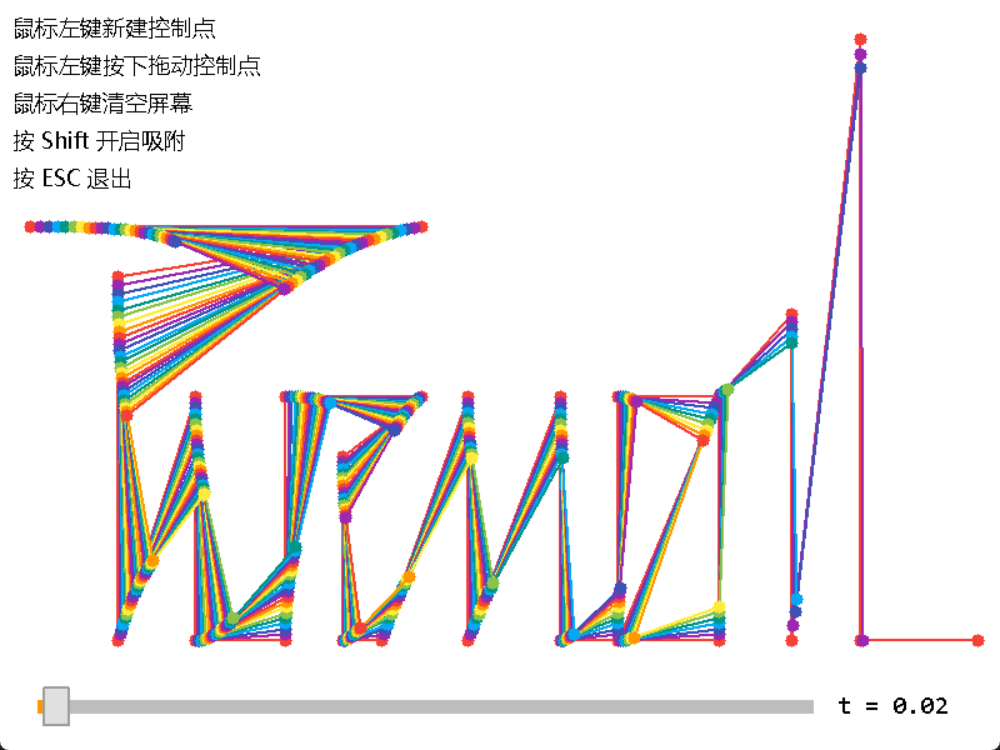
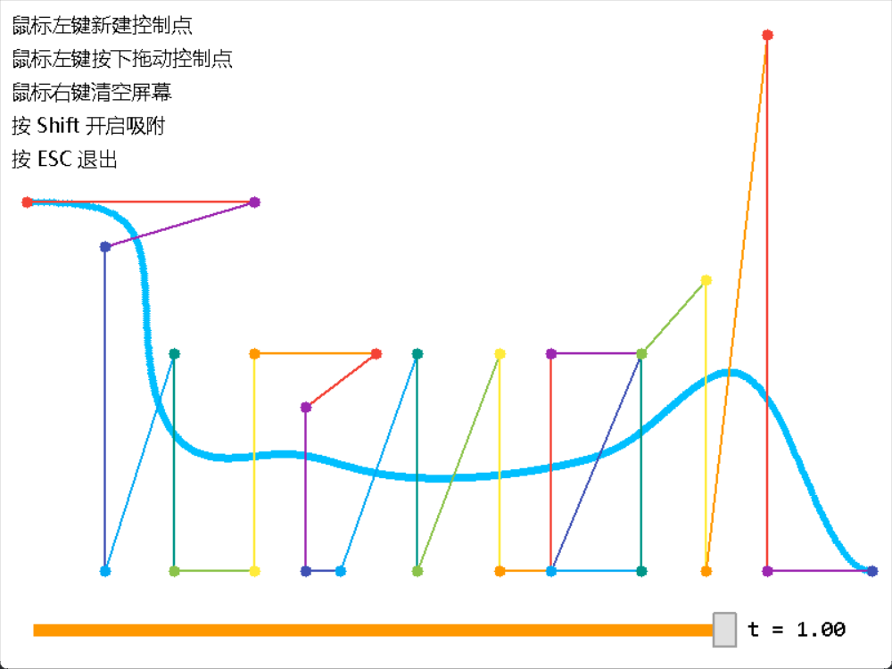

# Bezier Visualizer

> Copyright &copy; Tony's Studio 2023

This is a simple program to visualize Bezier curves. It is written in C++ with [EasyX](https://easyx.cn/).

Original idea comes from [贝塞尔曲线](https://codebus.cn/renderluu/bezier-curves).

## Screenshot

