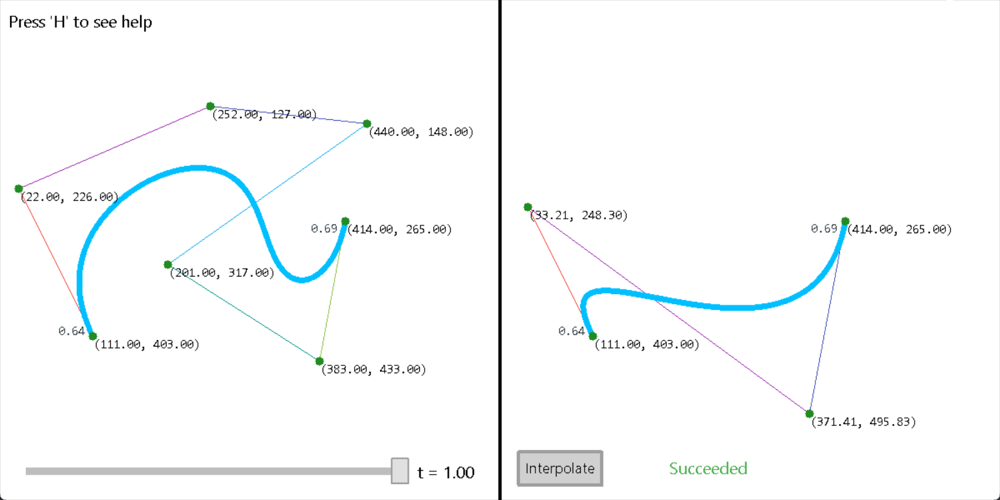
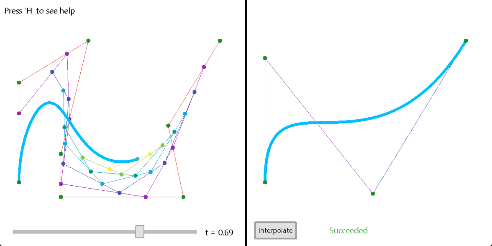

# Bezier Visualizer

> Copyright &copy; Tony's Studio 2023

---

This is a simple program to visualize Bezier curves. It is written in C++ with [EasyX](https://easyx.cn/). Powered by [Dungine](https://github.com/Lord-Turmoil/Dungeon).

## Screenshot

## Overview

With graphical interface, you can draw Bezier curve interactively, and then use a Bezier curve of power 3 for to interpolate the starting and ending point.
